# 🌿 GreenMeet
La aplicación **GreenMeet** permite a los usuarios crear, publicar y participar en actividades 
urbanas sostenibles y saludables, fomentando la colaboración ciudadana, la creación de comunidades
y la participación activa en la mejora del entorno y del bienestar personal.

  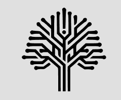

 

## 📲 Funcionalidades Principales

La aplicación cuenta con varias secciones clave para ofrecer una experiencia de usuario completa y fluida.

### 1. **Onboarding Introductorio**
La primera vez que un usuario abre la app, se le presenta una serie de pantallas introductorias (`NavigationActivity`) que explican el propósito de GreenMeet. Este flujo guía al usuario hasta la pantalla de inicio de sesión.

 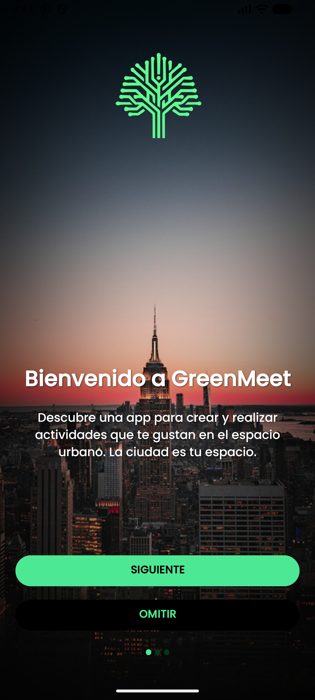  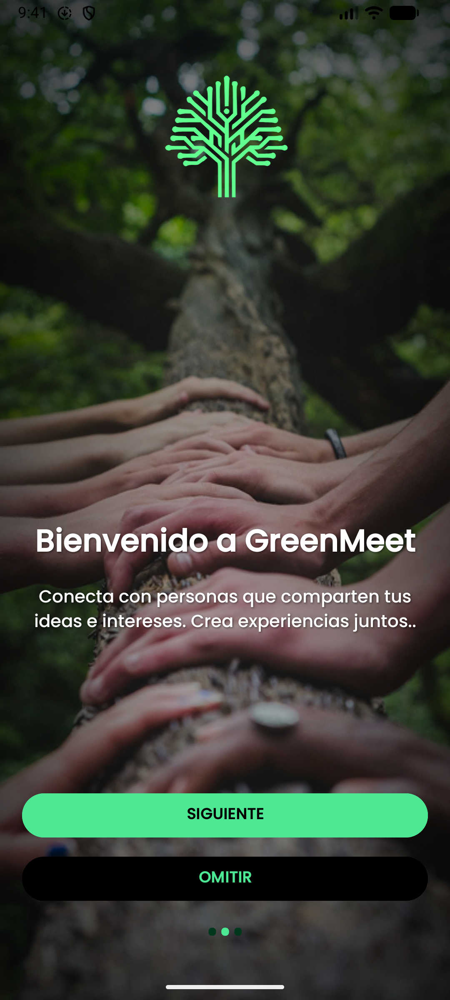  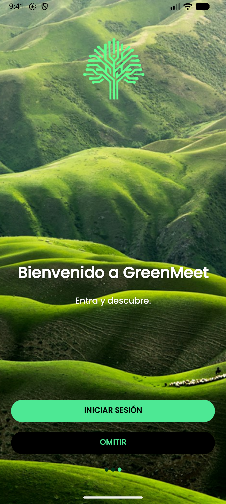 

### 2. **Login y Signup**

El usuario deberá iniciar sesión o registrarse para poder acceder a la aplicación.

 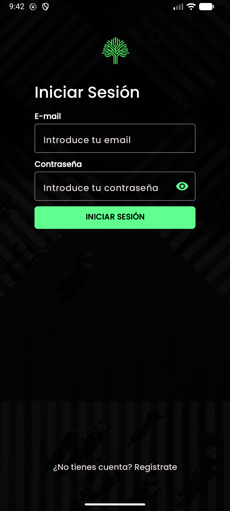  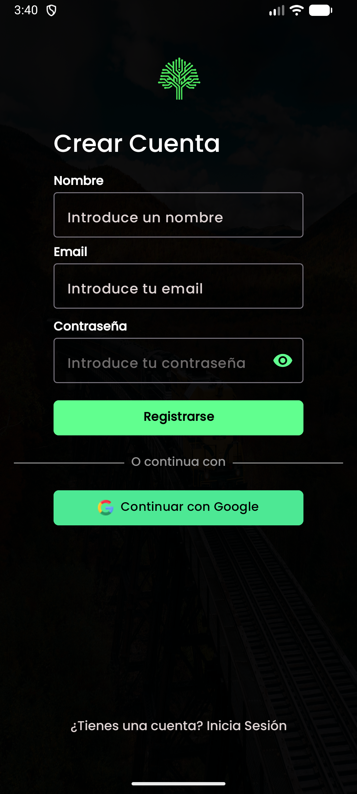 

### 3. **Explorar Actividades**

Descubre nuevas actividades cerca de ti. La pantalla principal (`HOME`) te muestra las últimas actividades creadas, donde puedes filtrar por categorías.  
Usa la barra de búsqueda en `ExploreFragment` para filtrar por nombre.  
Las actividades a las que te apuntes se guardarán en `InscriptionsFragment`.

| **HOME** | **Explorar** | **Inscritas** |
|:--------:|:------------:|:------------:|
| 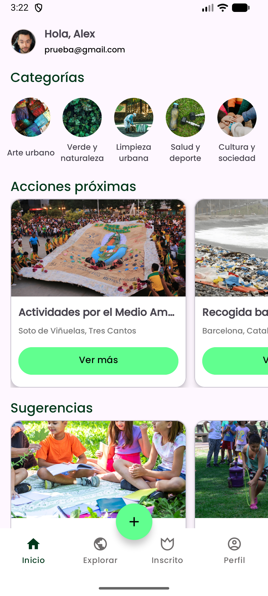 Últimas actividades y categorías | 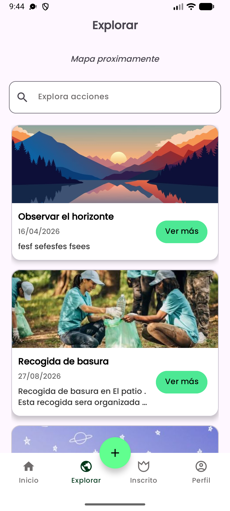 Buscar y filtrar actividades | 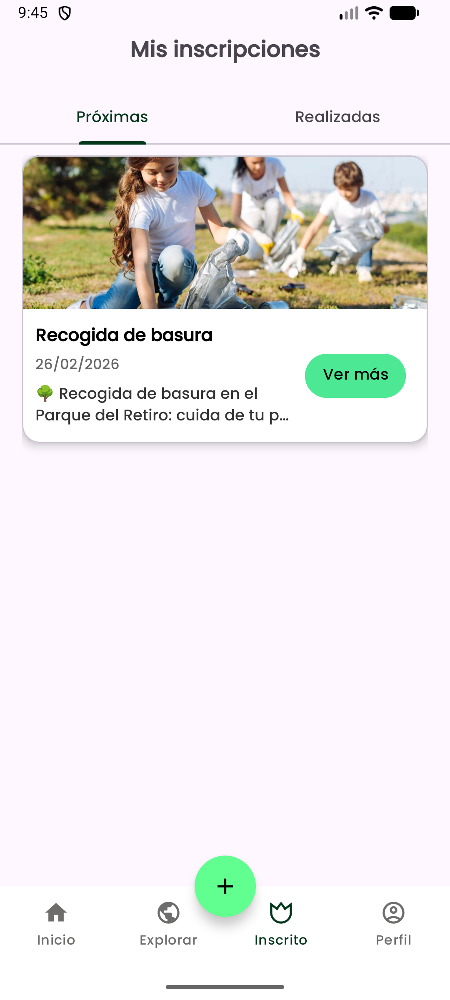 Actividades a las que te has inscrito |

### 4. **Crear Actividades**
Conviértete en un organizador y crea tus propios eventos. A través de un sencillo formulario, puedes especificar todos los detalles:
- Título y descripción.
- Fecha y hora.
- Ubicación.
- Límite de participantes.
- Una imagen representativa.

 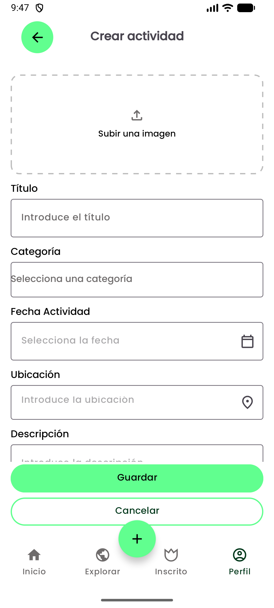 

### 5. **Gestión de Perfil**
Dentro de la opción de perfil encontrarás:

- **Perfil de Usuario**: Visualiza y edita tu información personal.  
- **Mis Actividades**: Almacena las actividades que has creado, con posibilidad de editarlas.  
- **Idioma**: Cambia el idioma de la aplicación entre español e inglés.  
- **Política de Privacidad**: Muestra la información sobre las políticas de privacidad.  
- **Licencias**: Referencias de las imágenes utilizadas en el proyecto.  
- **Desconectarse**: Cierra la sesión actual al hacer click.

| **Perfil** | **Editar Perfil** | **Editar Actividad** |
|:--------:|:------------:|:------------:|
| 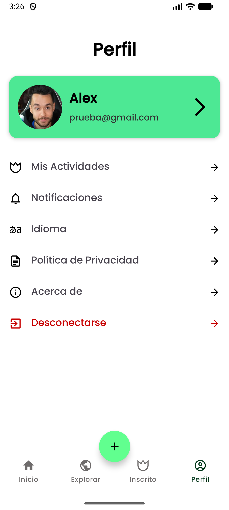 | 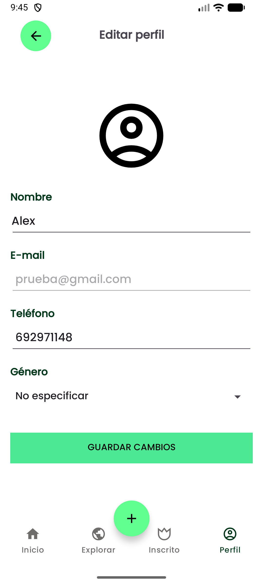 | 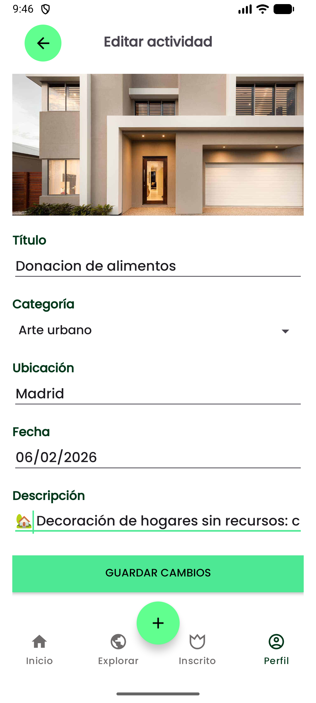 |

### 6. **Autenticación de Usuarios**
La aplicación cuenta con un sistema seguro de registro e inicio de sesión mediante `LoginActivity` y `SignupActivity`.  

- Permite a los usuarios crear una cuenta y loguearse con ella.  
- Toda la información se almacena en **Firebase**, garantizando que:
  - Los datos estén seguros y validados.  
  - Los usuarios deben autenticarse correctamente antes de acceder a la pantalla **HOME**.
  - Las **actividades** que crea cada usuario también se almacenan en Firebase, permitiendo que puedan ser editadas, consultadas y sincronizadas en tiempo real. 
- Este flujo asegura que cada sesión esté protegida y que los datos de usuario se mantengan sincronizados con la base de datos.

 

## 🛠️ Tecnologías y Arquitectura

Este proyecto está construido siguiendo las mejores prácticas de desarrollo para **Android**, utilizando una arquitectura moderna y modular.

### Arquitectura
La aplicación sigue el patrón de diseño **MVVM (Model-View-ViewModel)**, que asegura:

- Separación clara de responsabilidades.
- Código más mantenible y escalable.
- Flujo de datos unidireccional entre la UI y la lógica de negocio.

### Dependencias Principales
A continuación se muestra una tabla con las librerías más importantes utilizadas en el proyecto:

| Librería| Propósito                                            |
| -------------------------------------------- | ---------------------------------------------------- |
| `androidx.appcompat:appcompat`               | Soporte para componentes de la interfaz de usuario.  |
| `com.google.android.material:material`       | Componentes de diseño de Material Design.            |
| `androidx.viewpager:viewpager`               | Paginación de vistas (usado en Onboarding).          |
| `com.google.firebase:firebase-auth`          | Sistema de autenticación de usuarios.                |
| `com.google.firebase:firebase-firestore`     | Base de datos NoSQL en la nube para almacenar datos. |
| `com.google.firebase:firebase-storage`       | Almacenamiento de archivos (imágenes de actividad).  |
| `com.github.bumptech.glide:glide`            | Carga y caché de imágenes de forma eficiente.        |

 

## 🤝 Contribuciones

Las contribuciones son bienvenidas. Si tienes ideas para mejorar la aplicación o encuentras un error, por favor abre un *issue* o envía un *pull request*.

 

## 📄 **Licencia**

> This repository is licensed under  
> [Creativecommons Org Licenses By Sa 4](http://creativecommons.org/licenses/by-sa/4.0/)
---

