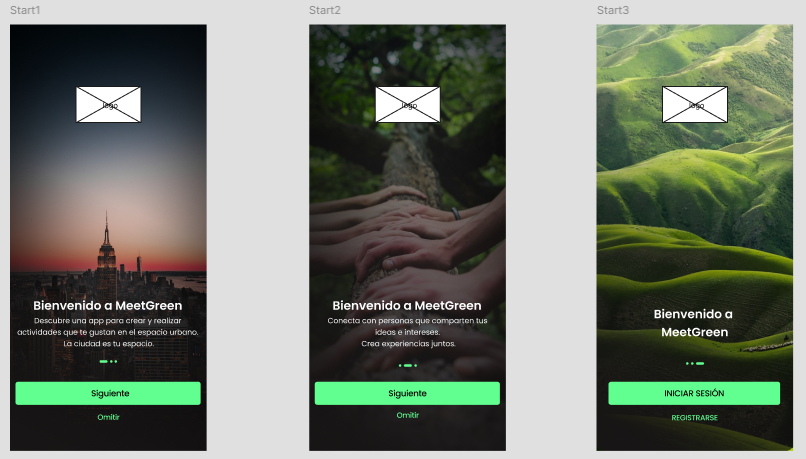
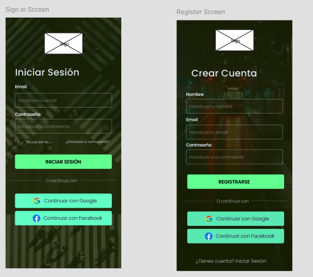
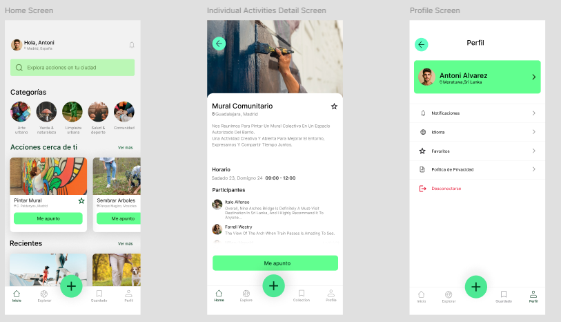
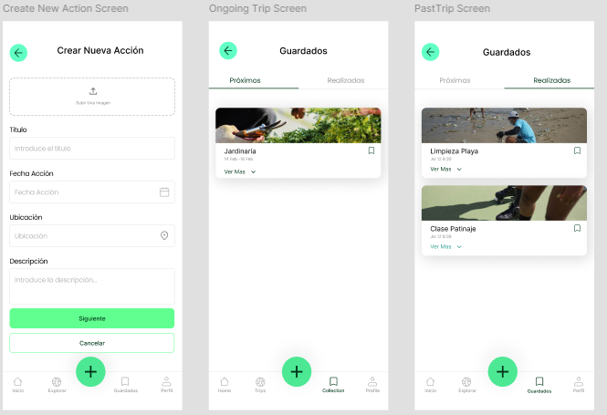
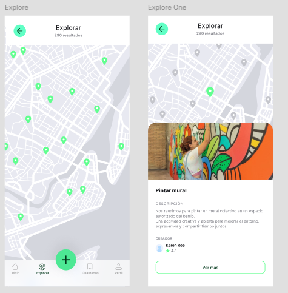

# 🌿 GreenMeet
La aplicación **GreenMeet** permite a los usuarios crear, publicar y participar en actividades 
urbanas sostenibles y saludables, fomentando la colaboración ciudadana, la creación de comunidades
y la participación activa en la mejora del entorno y del bienestar personal.

  

## Funcionalidades Principales

La aplicación cuenta con varias secciones clave para ofrecer una experiencia de usuario completa y fluida.

### 1. **Onboarding Introductorio**
La primera vez que un usuario abre la app, se le presenta una serie de pantallas introductorias (`NavigationActivity`) que explican el propósito de GreenMeet. Este flujo guía al usuario hasta la pantalla de inicio de sesión.

<!-- Inserta aquí una captura de la pantalla de Onboarding -->

### 2. **Explorar Actividades**
Encuentra nuevas actividades ecológicas cerca de ti. La pantalla principal te muestra las últimas actividades creadas, y puedes usar la barra de búsqueda para filtrar por nombre o descripción.

<!-- Inserta aquí una captura de la pantalla Explorar -->

### 3. **Crear Actividades**
Conviértete en un organizador y crea tus propios eventos. A través de un sencillo formulario, puedes especificar todos los detalles:
- Título y descripción.
- Fecha y hora.
- Ubicación.
- Límite de participantes.
- Una imagen representativa.

<!-- Inserta aquí una captura de la pantalla de Creación de Actividad -->

### 4. **Gestión de Perfil y Actividades Guardadas**
- **Perfil de Usuario**: Visualiza y edita tu información personal.
- **Actividades Guardadas**: Marca las actividades que te interesan y guárdalas para acceder a ellas fácilmente más tarde.

<!-- Inserta aquí una captura de la pantalla de Perfil -->

### 5. **Autenticación de Usuarios**
Un sistema de registro e inicio de sesión seguro (`LoginActivity`) que permite a los usuarios gestionar su cuenta y participar en la comunidad.

## 🛠️ Tecnologías y Arquitectura

Este proyecto está construido siguiendo las mejores prácticas de desarrollo para Android, utilizando una arquitectura moderna y librerías robustas.

### Arquitectura
La aplicación sigue el patrón de diseño **MVVM (Model-View-ViewModel)**, lo que garantiza una separación clara de responsabilidades y un código más mantenible y escalable. La estructura de paquetes sugerida es:

/src/main/java/com/alenic/greenmeet/ ├── activities/     # Controladores de UI (Activities) ├── adapters/       # Adaptadores para RecyclerViews y ViewPagers ├── fragments/      # Vistas modulares (Fragments) ├── models/         # Clases de datos (POJOs) └── viewmodel/      # ViewModels que exponen datos a la UI

### Dependencias Principales
A continuación se muestra una tabla con las librerías más importantes utilizadas en el proyecto:

| Librería| Propósito                                            |
| -------------------------------------------- | ---------------------------------------------------- |
| `androidx.appcompat:appcompat`               | Soporte para componentes de la interfaz de usuario.  |
| `com.google.android.material:material`       | Componentes de diseño de Material Design.            |
| `androidx.lifecycle:lifecycle-viewmodel-ktx` | Implementación de ViewModel en la arquitectura MVVM. |
| `androidx.recyclerview:recyclerview`       | Para mostrar listas de datos de forma eficiente.     |
| `androidx.viewpager:viewpager`               | Paginación de vistas (usado en Onboarding).          |
| `com.google.firebase:firebase-auth`          | Sistema de autenticación de usuarios.                |
| `com.google.firebase:firebase-firestore`     | Base de datos NoSQL en la nube para almacenar datos. |
| `com.google.firebase:firebase-storage`       | Almacenamiento de archivos (imágenes de actividad).  |
| `com.github.bumptech.glide:glide`            | Carga y caché de imágenes de forma eficiente.        |

## 🚀 Cómo Empezar

Para clonar y ejecutar este proyecto en tu entorno local, sigue estos pasos:

1.  **Clona el repositorio:**
2.  **Abre el proyecto en Android Studio.**

3.  **Configura Firebase:**
    - Crea un proyecto en la [consola de Firebase](https://console.firebase.google.com/).
    - Añade tu app de Android al proyecto de Firebase (usa el package name `com.alenic.greenmeet`).
    - Descarga el archivo `google-services.json` y colócalo en el directorio `app/`.
    - Habilita los servicios de **Authentication**, **Firestore Database** y **Storage**.

4.  **Sincroniza y ejecuta la aplicación.**

## 🤝 Contribuciones

Las contribuciones son bienvenidas. Si tienes ideas para mejorar la aplicación o encuentras un error, por favor abre un *issue* o envía un *pull request*.

---

    

## 📱 Prototipo 

